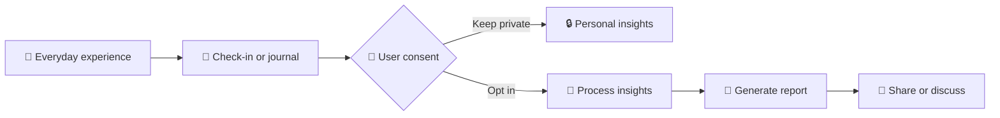
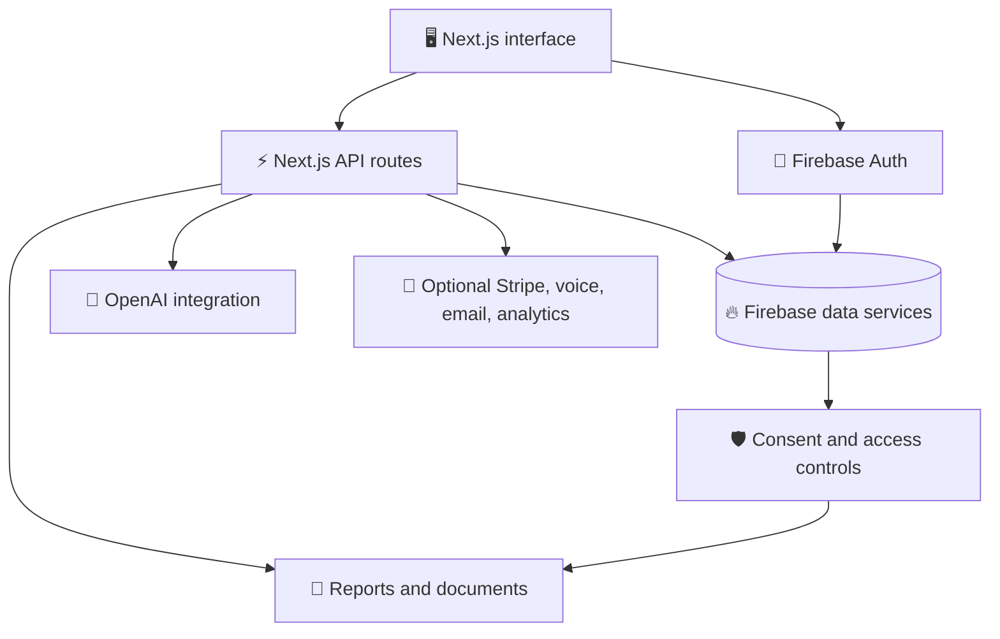

# 🧠 AARA Prep

### Turn everyday experiences into clearer conversations.

  <strong>An open-source pre-therapy and therapy companion for reflection, preparation, and consent-based sharing.</strong>

  
  
  
  

  <a href="#-at-a-glance">At a glance</a> ·
  <a href="#-features">Features</a> ·
  <a href="#-getting-started">Quick start</a> ·
  <a href="#-architecture">Architecture</a> ·
  <a href="CONTRIBUTING.md">Contribute</a>

> **The idea:** capture what you are experiencing, understand the patterns, and decide what you want to share—with consent at every step.

## ✨ At a glance

AARA Prep is under active development. Core product areas include authentication, check-ins, journaling, AI-assisted conversation, insights, reports, and therapist-oriented sharing workflows. Interfaces and integrations may change as the project is stabilized.

| | What AARA Prep offers |
| --- | --- |
| 📝 **Reflect** | Check-ins, journaling, and guided prompts |
| 🧩 **Understand** | Themes, patterns, and time-based insights |
| 📄 **Prepare** | Reports for personal reflection or a professional session |
| 🤝 **Share intentionally** | Consent-based sharing and revocation controls |
| 🔓 **Stay open** | An open-source foundation for contributors and experimentation |

📚 **Explore the project:** [Contributing](CONTRIBUTING.md) · [Roadmap](ROADMAP.md) · [Security](SECURITY.md) · [Code of Conduct](CODE_OF_CONDUCT.md) · [Changelog](CHANGELOG.md)

## 🛡️ Safety and privacy boundaries

AARA Prep is not a therapist, diagnosis tool, medical-advice service, or crisis-care service. If you are in immediate danger or experiencing a crisis, contact local emergency services or a qualified crisis resource.

The project is built around explicit consent: private information should remain private unless a user intentionally chooses to use or share it. This repository does not make a guarantee of legal or regulatory compliance; deployment owners are responsible for their own security, privacy notices, retention, and compliance decisions.

## 🚀 Features

- 🤖 **AI-assisted conversation** with optional voice integrations
- ✅ **Daily check-ins** and progressive reflection prompts
- 📔 **Private journaling** with text and voice entries
- 📊 **Insights** across configurable time ranges
- 📄 **Reports** for reflection or professional-session preparation
- 🤝 **Consent-based sharing** with read-only therapist views
- 🔒 **Revocation controls** and optional PDF generation
- 🩺 **Therapist discovery and booking** where configured

## 🗺️ The experience

## 🏗️ Architecture

The application is organized as a Next.js app with API routes, reusable React components, Firebase-backed authentication and data services, and optional integrations for AI, voice, payments, email, and analytics.

## 🧰 Technology

- Next.js 14, React 18, and TypeScript
- Tailwind CSS and Framer Motion
- Firebase Authentication, Firestore, and Realtime Database
- OpenAI API for AI features
- ElevenLabs for optional text-to-speech features
- Stripe for optional payments
- Puppeteer and jsPDF for document workflows
- Vercel-compatible deployment configuration

## ⚡ Getting started

### ✅ Prerequisites

- Node.js 18 or later
- npm
- A Firebase project for authentication and data features
- An OpenAI API key for AI features

Stripe, ElevenLabs, email, analytics, and deployment credentials are optional until you use the features that depend on them.

### 📦 Install

1. Clone the repository: `git clone https://github.com/Umar-frauq/Aara-Prep.git`
2. Enter the project: `cd Aara-Prep`
3. Install dependencies: `npm install`

### 🔐 Configure local environment variables

Create `.env.local` in the project root. Never commit this file or share its contents.

Required or commonly used variables include `NEXT_PUBLIC_FIREBASE_API_KEY`, `NEXT_PUBLIC_FIREBASE_AUTH_DOMAIN`, `NEXT_PUBLIC_FIREBASE_PROJECT_ID`, `NEXT_PUBLIC_FIREBASE_STORAGE_BUCKET`, `NEXT_PUBLIC_FIREBASE_MESSAGING_SENDER_ID`, `NEXT_PUBLIC_FIREBASE_APP_ID`, `NEXT_PUBLIC_FIREBASE_DATABASE_URL`, and `OPENAI_API_KEY`.

Optional integrations use `STRIPE_SECRET_KEY`, `STRIPE_WEBHOOK_SECRET`, `NEXT_PUBLIC_STRIPE_PUBLISHABLE_KEY`, `ELEVENLABS_API_KEY`, `NEXT_PUBLIC_MIXPANEL_TOKEN`, and `SITE_URL`.

Use development credentials only. Do not place secrets in variables prefixed with `NEXT_PUBLIC_`; Next.js exposes those values to the browser.

### ▶️ Run locally

Start the development server with `npm run dev`, then open [http://localhost:3000](http://localhost:3000).

## 🔥 Firebase setup

1. Create a Firebase project.
2. Enable the sign-in methods your environment needs.
3. Create a Firestore database and configure security rules.
4. Enable Realtime Database if required by the features you use.
5. Add the Firebase web-app values to `.env.local`.
6. Test with non-production accounts before deployment.

Do not use permissive development rules in production. Review Firebase rules whenever a feature changes how user data is read, written, or shared.

## 🧪 Quality checks

Run these checks before opening a pull request: `npm run lint`, `npm run typecheck`, and `npm run build`.

The build may require valid integration configuration because some application paths depend on Firebase or other external services.

## 🚢 Deployment

AARA Prep includes Vercel configuration. Import the repository into Vercel, configure environment variables in the Vercel project settings, configure Firebase authorized domains and production rules, and run a production smoke test with a test account.

Never copy `.env.local` into a public repository or paste credentials into issues, pull requests, logs, or screenshots.

## 🗂️ Repository layout

- `app/` — Next.js pages, layouts, and API routes
- `components/` — Reusable UI and product components
- `context/` and `contexts/` — Shared state and providers
- `functions/` — Backend and integration functions
- `hooks/` — Reusable React hooks
- `lib/` — Firebase, AI, auth, payments, and utility modules
- `public/` — Static assets and PWA resources
- `scripts/` — Maintenance and data scripts
- `docs/` — Supporting documentation

## 💬 Contributing and support

Read [CONTRIBUTING.md](CONTRIBUTING.md) before opening an issue or pull request. For changes involving authentication, consent, data sharing, or external integrations, include security and privacy implications in the pull request description.

Use the repository issue templates for bugs and feature requests. Do not post private user information, API keys, or security vulnerabilities in public issues; see [SECURITY.md](SECURITY.md).

## 📄 License

This project is licensed under the [MIT License](LICENSE).

Built for more thoughtful preparation and communication around mental wellness.
